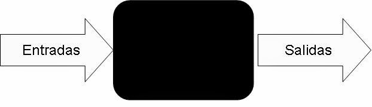

# Curso de Introducción a la Inteligencia Artificial 2017 de Platzi

TROL(L) fue una de las bromas más grandes hechas en el mundo de Machine Learning hace algún tiempo. Donde se demostró lo fuerte que está esta tendencia, pero también la poca información que se tiene de ella.

- [Curso de Introducción a la Inteligencia Artificial 2017 de Platzi](#curso-de-introducci%C3%B3n-a-la-inteligencia-artificial-2017-de-platzi)
  - [Inteligencia Artificial](#inteligencia-artificial)
  - [Anatomía de la IA](#anatom%C3%ADa-de-la-ia)
  - [Machine Learning](#machine-learning)
    - [Otros conceptos de estudiantes](#otros-conceptos-de-estudiantes)

## Inteligencia Artificial

Intento de hacer a un dispositivo tan o más inteligente que un humano. Darle la capacidad de razonar o pensar en función a los datos que se le está pasando.

**Niveles de Inteligencia Artificial**:

- Inteligencia Artificial Débil. Ejemplo, un asistente de celular como Siri. No rebasan la línea de lo que están programados para hacer.
- Inteligencia Artificial Fuerte. Tiene la habilidad de reconocer patrones en el comportamiento humano y/o el ambiente.
- Super Inteligencia Artificial. Supera la inteligencia de un humano, incluso alguno considerado genio. Tiene la capacidad de tomar decisiones propias,

**Singularity** = Es el nombre que se le da al concepto del momento en el que la Super Inteligencia Artificial va a dominar.

## Anatomía de la IA

En la anatomía de la Inteligencia Artificial existen 5 partes. Es importante tomar en cuenta que en la Inteligencia Artificial Débil no necesariamente deben existir estas 5. Sin embargo, para que una Inteligencia Artificial sea Fuerte o Super, sí las necesita.

Estas son las 5 partes:

1. Percepción. A través de sensores.
2. Procesamiento natural del lenguaje.
3. Representación del conocimiento. Darle una imagen gráfica a los conocimientos o eventos.
4. Razonamiento. Capacidad para tomar una decisión.
5. Planeación y Navegación. La forma de reaccionar ante situaciones inesperadas.

## Machine Learning

Serie de algoritmos que hacen que un sistema sea artificialmente inteligente.

Los algoritmos se dividen en 2 partes:

- Aprendizaje supervisado. En este aprendizaje somos nosotros los que guiamos al algoritmo a la respuesta correcta.
- Aprendizaje sin supervisión. El algoritmo detecta patrones y agrupa la información con estos patrones. Aquí nosotros podemos darle características a los algoritmos y éstos agrupan todo mediante patrones relacionados con esa información.

### Otros conceptos de estudiantes

El machine learning es una rama de la inteligencia artificial enfocada en que los sistemas aprendan autónomamente.

En el contexto de los sistema inteligentes APRENDER significa que una máquina tenga la capacidad de identificar patrones complejos en millones de datos.

Los tipos de aprendizaje principales son:

- Aprendizaje supervisado: Algoritmos que permiten clasificar o hacer predicciones a futuro basados en el comportamiento o carácteristicas de los datos ya almacenados. A los datos ya almacenados se les conoce como datos de entrenamiento, los cuales nosotros mismos le proporcionamos al sistema con el fin de que aprenda a identificar los patrones específicos (con esto guíamos el algoritmo). En algoritmos supervisados la caracterítica principal de los datos de entrenamiento es que ya vienen etiquetados (clasificados), es decir, que para cada entrada se conoce previamente su salida al entrar al sistema.

- Aprendizaje no supervisado: Algoritmos con un caracter altamente exploratorio, cuyo fin es encontrar patrones, estructuras o formas dentro de datos de entrenamiento no etiquetados (no clasificados), es decir que el algoritmo va a ciegas y debe aprender a identificar por si solo conjuntos y grupos de datos con base a sus similitudes y carácteristicas.

Resumiendo lo anterior, si vemos al sistema como una caja negra:

En los supervisados se conoce la entrada y la salida de la caja negra y debe aprender a identificar los datos nuevos que lleguen al sistema con base a estos; mientras que en los no supervisados el sistema solo conoce la entrada de la caja negra, y debe tratar de inferir cual sería la salida.